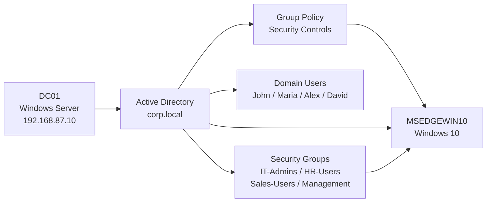

# Windows Active Directory Security Lab

## Overview

This project is a hands-on Active Directory security lab built using a Windows Server Domain Controller and a Windows 10 domain client.

The lab demonstrates practical Windows administration and cybersecurity skills including Active Directory configuration, organizational unit management, user and group administration, Group Policy security controls, Windows Firewall configuration, Remote Desktop access management, PowerShell-based Active Directory enumeration, and domain connectivity verification.

## Lab Environment

| Component         | Configuration              |
| ----------------- | -------------------------- |
| Domain Controller | Windows Server — `DC01`    |
| Domain            | `corp.local`               |
| NetBIOS Domain    | `CORP`                     |
| Client            | Windows 10 — `MSEDGEWIN10` |
| Virtualization    | VMware                     |
| Network           | Private lab network        |
| DNS Server        | `192.168.87.10`            |



## Active Directory Structure

The following organizational units were created:

* IT
* HR
* Sales
* Management

Four domain users were created and assigned to their respective departments:

| User         | Department |
| ------------ | ---------- |
| John Smith   | IT         |
| Maria Brown  | HR         |
| Alex Taylor  | Sales      |
| David Wilson | Management |

Security groups were also created to manage access:

| Security Group | Member       |
| -------------- | ------------ |
| IT-Admins      | John Smith   |
| HR-Users       | Maria Brown  |
| Sales-Users    | Alex Taylor  |
| Management     | David Wilson |

## Security Controls

### Account Lockout Policy

A domain-level Group Policy was configured with:

* Account lockout threshold: **5 failed attempts**
* Account lockout duration: **15 minutes**
* Reset account lockout counter: **15 minutes**

### Windows Defender Firewall

A Group Policy was used to configure the Windows Defender Firewall on the Windows 10 client.

The verified configuration includes:

* Firewall enabled
* Inbound connections blocked
* Outbound connections allowed

### Remote Desktop Access

A Remote Desktop policy was configured and the `IT-Admins` Active Directory group was added to the client's `Remote Desktop Users` group.

This demonstrates the relationship between Active Directory group membership and endpoint access permissions.

## PowerShell Administration

PowerShell was used to validate the Active Directory configuration.

Examples included:

* Enumerating domain users
* Enumerating Active Directory groups
* Checking group membership
* Checking the Windows 10 computer account
* Enumerating organizational units
* Verifying user OU placement

Example commands:

```powershell
Get-ADUser -Filter *

Get-ADGroup -Filter *

Get-ADGroupMember -Identity "IT-Admins"

Get-ADComputer -Identity "MSEDGEWIN10"

Get-ADOrganizationalUnit -Filter *
```

## Domain and Network Verification

The Windows 10 client was verified as a member of the `corp.local` domain.

DNS resolution was tested using:

```cmd
nslookup DC01.corp.local
```

The Domain Controller was located using:

```cmd
nltest /dsgetdc:corp.local
```

Group Policy application was also verified on the Windows 10 client using:

```cmd
gpresult /scope computer /r
```

The client successfully received domain policies including:

* Default Domain Policy
* Domain Account Security Policy
* IT Firewall Policy
* IT Security Policy

## Evidence

Screenshots documenting the lab configuration and verification are stored in the `screenshots/` directory.

The evidence includes:

* Domain Controller configuration
* Active Directory structure
* User and group configuration
* Group Policy configuration
* Firewall configuration
* Remote Desktop access configuration
* PowerShell administration
* Domain and DNS verification
* Applied Group Policies

## Skills Demonstrated

* Active Directory administration
* Windows Server administration
* Domain Controller configuration
* Organizational Unit management
* User and group management
* Group Policy management
* Windows Firewall configuration
* Access control
* PowerShell
* DNS troubleshooting
* Domain connectivity troubleshooting
* Windows endpoint administration
* Security hardening

## Lessons Learned

This project provided practical experience with deploying and managing an Active Directory environment and demonstrated how centralized security policies can be applied to Windows endpoints.

It also highlighted the importance of verifying configuration changes from both the Domain Controller and the client rather than assuming that a policy has been successfully applied.

## Project Status

**Completed hands-on lab and configuration.**

Further improvements could include centralized Windows event collection, advanced auditing, additional Group Policy security settings, and more detailed security monitoring.
